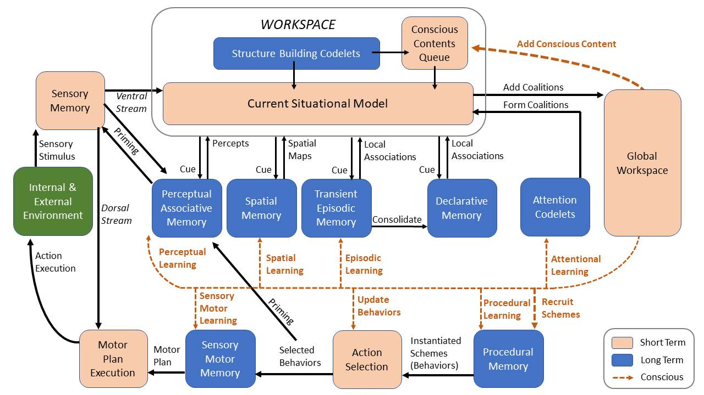
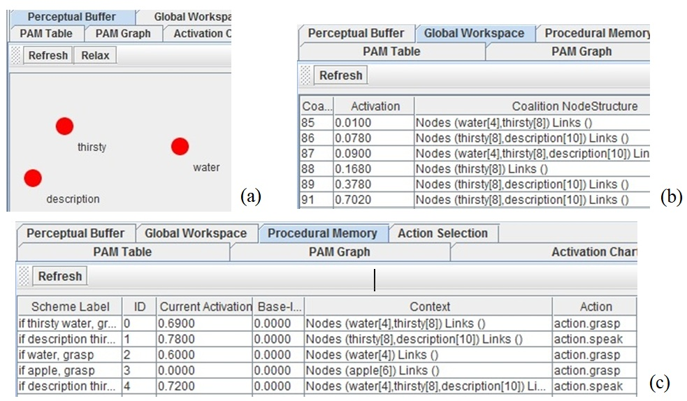

# An autonomous agent sharing its mind, describing its conscious contents
## Abstract
We enable an autonomous agent sharing its artificial mind to its audiences like humans. This supports the autonomous human robot interactions relying on a cognitive architecture, LIDA, which explains and predicts how minds work and is used as the controllers of intelligent autonomous agents. We argue that LIDA’s cognitive representations and processes may serve as the source of the mind content its agent shares out, autonomously.

We built a LIDA software agent embedding with a new description (sub) model, which enables the agent describing its conscious contents. Through this description, the agent’s mind is more observable so we can understand the agent’s entity, behaviors and intelligence directly. 

DOI: https://doi.org/10.1609/aaaiss.v2i1.27666

## LIDA and its architecture
The LIDA model (Learning Intelligent Decision Agent) (Franklin et al., 2016) hypothesizes and predicts how minds work. It provides an architecture integrating multiple cog-nitive modules, and each of which has different cognitive representations and processes. We argue that these cogni-tive components may naturally serve as the source of the mind content an agent shares out.

It has integrated three phases: perception and understanding, attention, and action and learning (Fig. 1). These phases are functioning continually in a cognitive cycle (~10 Hz) and may (partially) overlap among multiple cycles.

Figure 1: LIDA Cognitive Cycle Diagram  (Franklin et al., 2016)

## Experiment
We implemented the new description model into the LIDA agent, which senses an object of water from the external environment and has both a thirsty and description nodes built-in internally. The agent attends on some of these as its conscious content, and chooses to execute certain actions to meet its agenda, such as grasp, speak, or draw. 

In detail, we implemented the describing contents and behaviors among different LIDA modules (Fig. 2).

Figure 2: The snapshots of the LIDA agent’s inner modules: (a) Percepts of the Current Situational Model, (b) Attention coalitions in Global Workspace, and (c) Schemes in Procedural Memory 

## Usage
